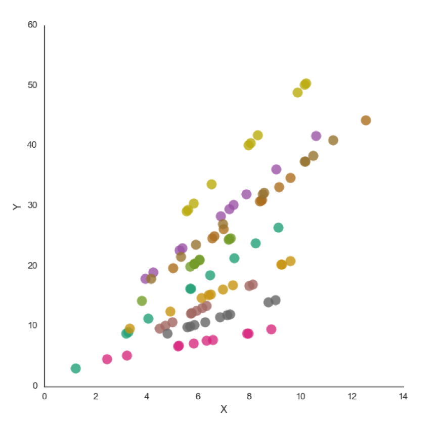
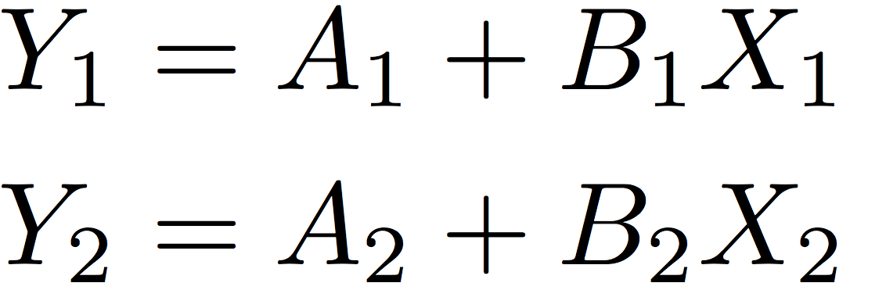
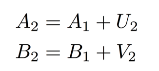

# FHHPS

Code for the paper Jeremy Fox, Vitor Hadad, Stefan Hoderlein, Amil Petrin and Robert Sherman (In progress). *Heterogenous Production Functions, Panel Data, and Productivity Dispersion*. Henceforth <i>FHHPS</i>, after the authors' initials.

<center>

</center>

## Estimation setup

The setup is a linear panel data with two correlated random coefficients. 

<center>

</centeR>

It is assumed that the coefficients follow AR(1) processes

<center>

</center>

where the shocks are assumed to be independent of everything in the previous period.

The application we have in mind is the identification and estimation of first and second moments of Cobb Douglas coefficients of a production function. For more details, please contact Vitor Hadad at baisihad@bc.edu.

## Installing 

To run `fhhps`, you will need Python 3.5 or newer. If you have no current Python installation, the fastest way to get everything up and running is by copying-and-pasting the following commands to your Terminal or Prompt (you will likely need root privileges).

**For MAC OSX**

```bash
wget http://repo.continuum.io/miniconda/Miniconda3-3.7.0-Linux-x86_64.sh -O ~/miniconda.sh
bash ~/miniconda.sh -b -p $HOME/miniconda
export PATH="$HOME/miniconda/bin:$PATH"
source $HOME/miniconda3/bin/activate
echo PATH="$HOME/miniconda3/bin:$PATH" >> ~/.bashrc
pip install numpy pandas matplotlib scikit-learn tqdm
```

**For Windows**

```bash
---- Coming soon -----
```

Make sure that everything is installed by typing

```bash
python --version
```

You should see:

```bash
Python 3.x.y :: Anaconda custom (x86_64)  # where x >= 5
```

Next, just download the file `fhhps.py` and follow the instructions below.

## Getting started

The easiest way to run FHHPS is via the command line application. Suppose we are working with the file `fake_data_1.csv`, which can find it in the `examples` folder above. Its first rows are:


|    X1 |    X2 |    Y1 |    Y2 |   other_column |
|------:|------:|------:|------:|---------------:|
|  1.64 |  2.12 |  9.7  | 12.11 |           0.46 |
|  0.67 | -0.06 | -0.09 |  1.81 |           0.22 |
| -0.46 | -1.49 |  0.28 |  0.48 |           0.13 |
|  2.84 |  1.63 |  8.56 |  9.02 |           0.99 |
| -0.26 | -0.36 |  0.73 |  1.18 |           0.96 |

To have FHHPS automatically detect columns named `X1`, `X2`, `Y1`, `Y2` and run with default parameters, simply use:

```bash
python fhhps.py -f fake_data_1.csv
```
The application will run the estimation algorithm, bootstrap 100 times, and produce the figures as tables below. Total running time should be around 10 minutes. 


<image src="figs/bootstrap_shocks_150945930898.png" style="float: center; width: 80%; margin-left: 10%;">
<image src="figs/bootstrap_random_coefficients_150945930898.png" style="float: center; width: 80%; margin-left: 10%;">


<centeR>
<image src="figs/output_tables.png" width = 500>
</center>

By default, the file names will have a timestamp as suffix, to avoid overwriting existing files. You can use a custom suffix with the option `-outs=[custom-suffix]`.

### Column names

If your file contains custom column names, use the `-X1`... parameters.

```
python fhhps.py -f [file-name].csv -X1=[column-name] -X2=[column-name] -Y1=[column-name] -Y2=[column-name]
```

### Tuning parameters

You can set the following tuning parameters:
  
+ **Shock parameters**
  + `-csh` or `--c_shocks` (default: 3)
  + `-ash` or `--alpha_shocks` (default: 0.2)
  + `-pl` or `poly_order` (default: 2)


+ **Nadaraya-Watson parameters**
  + `-cnw` or `--c_nw` (default: 0.5)
  + `-anw` or `--alpha_nw` (default: 1/2)

+ **Censoring parameters**
  + `-cc1` or `--c1_cens` (default: 1)
  + `-cc2` or `--c2_cens` (default: 1)
  + `-ac1` or `--alpha_cens_1` (default: 0.25)
  + `-ac2` or `--alpha_cens_2` (default: 0.125)

Notes:

+ Parameter `poly_order` refers to the order of polynomial regression to be used when estimating shock parameters. Other parameters as described in the paper.
+ Default values were chosen to match the "best" configuration used in the empirical application in the paper.

## Advanced usage


### Conditional bootstrap

```bash
--- Coming soon. Currently available only in the Python API. --- 
```

## Python API

You can also run FHHPS from within Python. Users familiar with `statsmodels` or `scikit-learn` will be familiar with the syntax. Here's an example.

```python
# Importing. Make sure fhhps.py is in the same directory!
from fhhps import FHHPS

# Initialize the fhhps object
algo = FHHPS(c_shocks = 4,
             alpha_shocks = .2,
             c_nw = .5,
             alpha_nw = 0.167,
             poly_order = 2)

# Add data previously read, e.g., from a csv file into a pandas DataFrame
algo.add_data(X1 = df["X1"],
              X2 = df["X2"],
              Y1 = df["Y1"],
              Y2 = df["Y2"])
              
# Fit the model once
algo.fit()   

# Now bootstrap e.g. 120 times
algo.boostrap(n_iterations = 120)

# Plot bootstrap densities. Output will be matplotlib figure and axes handles
(shockfig, shockaxes), (rcfig, rcaxes) = algo.plot_density()algo.plot_density()
shockfig.savefig("shock_figure.pdf")
rcfig.savefig("shock_figure.pdf")

# Grab table. Default output is csv.
shock_tab, rc_tab = algo.summary()

# Save tables to CSV
shock_tab.to_csv("shock_tables.csv")
shock_tab.to_csv("shock_tables.csv")
``` 

For more information, read the docs (coming soon).


## Generating fake data

The fake data above was created using the function `generate_data` that  draws from the same distribution as the "Simulations" portion of the FHHPS paper. You can find it in the `data_utils` submodule.

   


